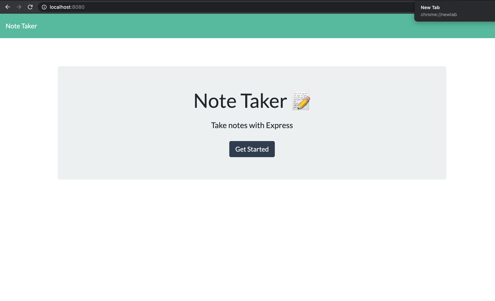
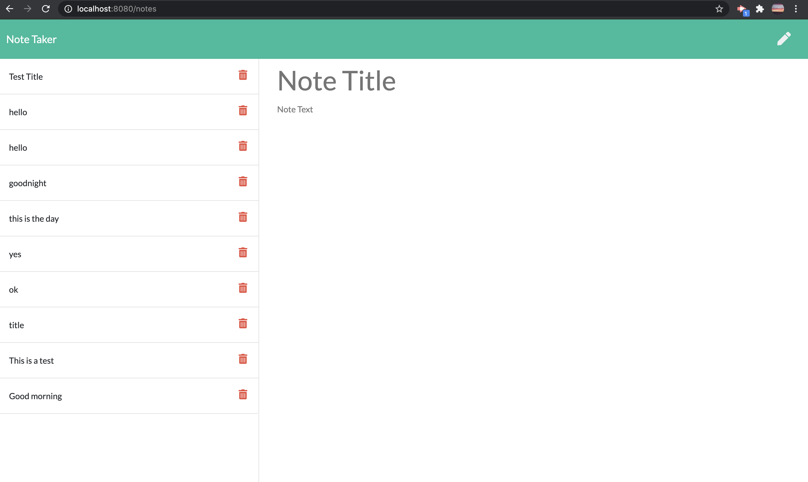
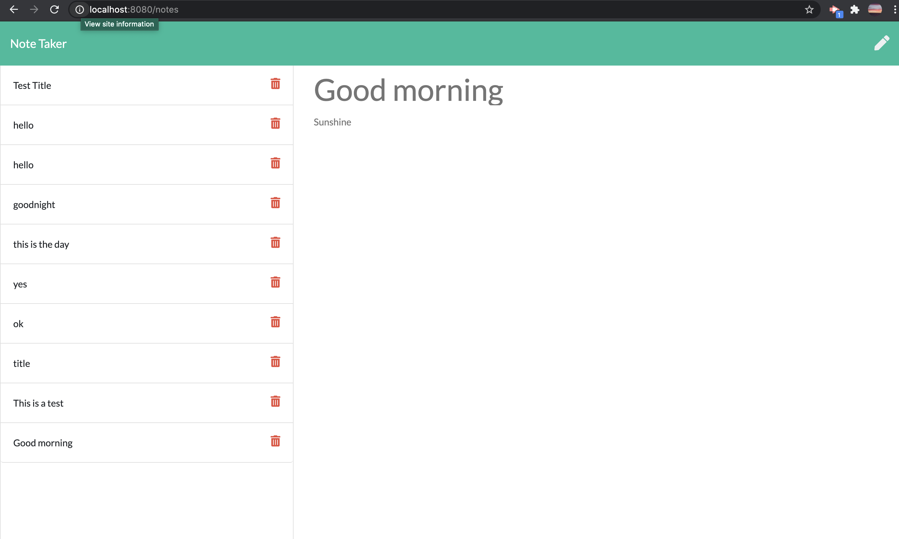

# note-taker

## Description 
- This application will enable user to write and save notes
- It should add notes to the side once the user saves it

 ---
# Table of Contents 

  - [Description](#Description)
  - [Technologies](#Technologies)
  - [Links](#Links)
  - [Screenshots](#Screenshots)
  - [License](#License)
  - [Questions](#questions)
---

## Technologies
node js, npm, express, JSON, Heroku

---
## Links
 Github: (https://github.com/joannejavillo/note-taker)

---
## Screenshots

---
## License
- MIT
---
## Questions
If you have any questions you can contact me at jo_anne.javillo@outlook.com or you can visit my gitHub page: (https://github.com/joannejavillo)